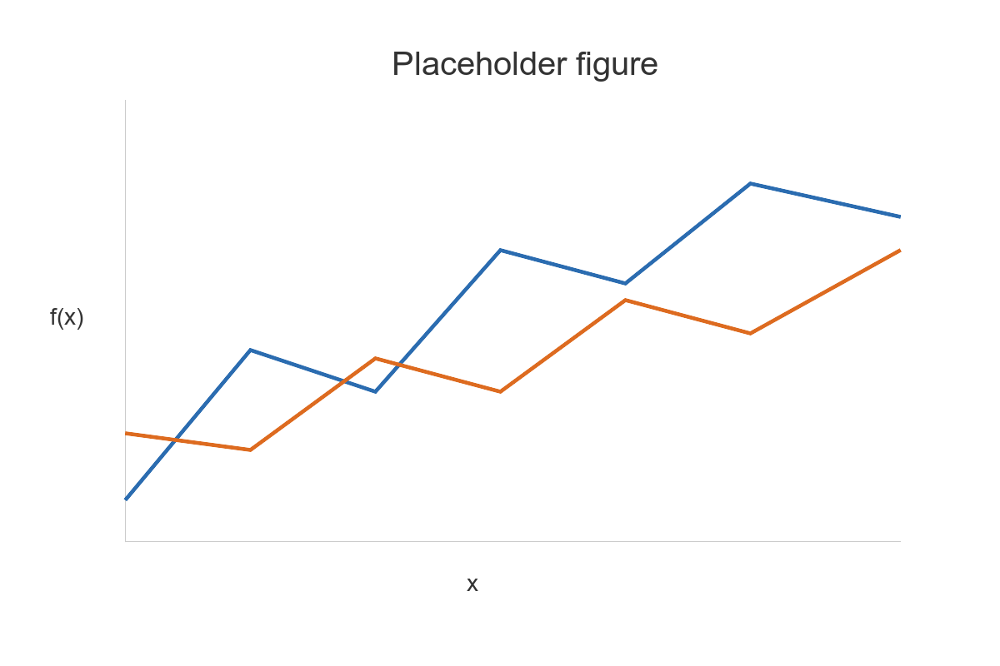

# Presentation Title

 

### Author One · Author Two · Author Three

#### University of Oxford

 

#### [patrickchang.net](https://patrickchang.net)

---

## Motivation

Open with the question the talk answers, in language a tired audience can follow. Give the context, then the gap.

Say why the question is worth 45 minutes: what is at stake, and for whom.

> Frame the puzzle as a single quotable line the room can hold onto.

And preview the answer up front, so the rest of the talk is confirmation rather than suspense.

---

## What we do

- Build a **model / dataset / experiment** for the problem
- Establish the **benchmarks** you will compare against
- Introduce the **method** that does the work
- Compare the **outcome** to the benchmarks

**Main finding.** State it in one sentence, in bold, before any detail.

---

## Setup

- **Ingredient A** — what it is and the role it plays
- **Ingredient B** — the second moving part
- **Actors / agents / units** — who or what is making choices

Two cases to compare:

- **Case 1** — the baseline, where nothing surprising happens
- **Case 2** — the linked / restricted / treated case that drives the result

---

## Benchmarks

**Case 1.** Describe the reference outcome and why it is the natural comparison.

**Case 2.** Introduce the key quantity

$$ y^{\star} = (1 - \lambda)\, J $$

and say in words what it represents and why it is the number to watch.

> A one-line statement of what standard analysis predicts here.

---
layout: two-cols-header
---

## The core mechanism

::left::

Explain the mechanism in words on the left. Keep each line short enough to read aloud.

Then note the twist: what unravels, what deviates, what does not behave as the benchmark says it should.

::right::

---

## Method

State the tool precisely, once:

$$ \hat{\theta}_{t+1} = (1-\alpha)\,\hat{\theta}_t + \alpha\, g_t $$

- What is being estimated / learned / optimised
- What is held fixed
- The one calibration choice worth defending

---

## Results

- **Case 1** → the outcome matches the benchmark
- **Case 2** → the outcome departs from it, robustly

Whenever the structure hands an advantage to the mechanism, it gets exploited — and the result is the same across specifications.

---

## Robustness / mechanism check

Show the result is not an artefact:

- Vary the **key assumption** → outcome persists
- Swap a component for a simpler one → outcome **changes**, which pins down the mechanism

> The contrast between "persists" and "breaks" is what identifies the cause.

---

## Takeaways

- The headline result, restated for the person who arrived late
- The broader **implication** for theory, practice, or policy
- What you would get wrong if you ignored it

One closing sentence on what the finding means for how we should think about the problem.

---
layout: center
class: text-center
---

# Thank you

[patrickchang.net](https://patrickchang.net)

 

Author One · Author Two · Author Three
